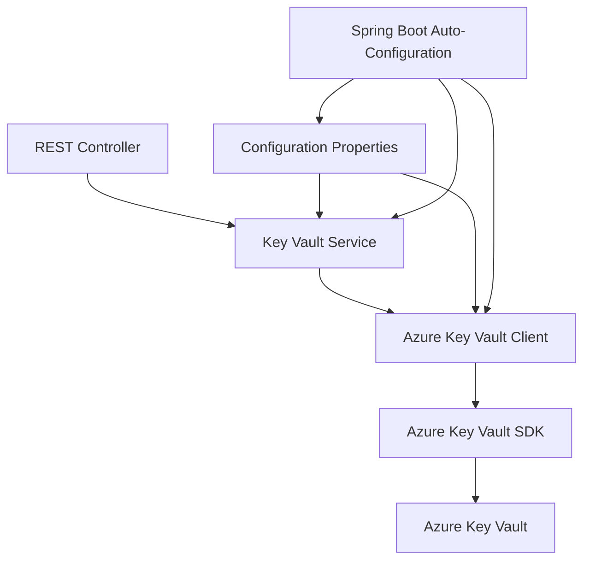

# Design Document: Spring Boot Azure Key Vault Integration

## Overview

This design outlines a Spring Boot application that integrates with Azure Key Vault using service principal authentication. The solution provides a clean, Spring-native approach to securely retrieving secrets from Azure Key Vault through a dedicated client class and proper configuration management.

The architecture follows Spring Boot conventions with externalized configuration, dependency injection, and comprehensive error handling. The design emphasizes security best practices, maintainability, and ease of use for developers.

## Architecture

The system follows a layered architecture pattern:



**Key Architectural Principles:**
- **Separation of Concerns**: Clear separation between configuration, service logic, and Azure SDK integration
- **Dependency Injection**: All components are Spring-managed beans for testability and loose coupling
- **Configuration Externalization**: All Azure-specific configuration is externalized and environment-specific
- **Error Boundary**: Comprehensive error handling at service and client levels

## Components and Interfaces

### 1. Configuration Properties (`AzureKeyVaultProperties`)

**Purpose**: Encapsulates all Azure Key Vault configuration parameters
**Responsibilities**:
- Bind external configuration to strongly-typed properties
- Validate required configuration at startup
- Support multiple environments through Spring profiles

```java
@ConfigurationProperties(prefix = "azure.keyvault")
@Validated
public class AzureKeyVaultProperties {
    @NotBlank private String clientId;
    @NotBlank private String clientSecret;
    @NotBlank private String tenantId;
    @NotBlank private String vaultUrl;
}
```

### 2. Key Vault Client (`AzureKeyVaultClient`)

**Purpose**: Manages Azure Key Vault connections and operations
**Responsibilities**:
- Establish authenticated connections using service principal
- Provide secret retrieval operations
- Handle Azure SDK exceptions and convert to application-specific exceptions
- Manage connection lifecycle

```java
@Component
public class AzureKeyVaultClient {
    private final SecretClient secretClient;
    
    public AzureKeyVaultClient(AzureKeyVaultProperties properties);
    public String getSecret(String secretName) throws KeyVaultException;
}
```

### 3. Key Vault Service (`KeyVaultService`)

**Purpose**: Business logic layer for Key Vault operations
**Responsibilities**:
- Provide high-level secret retrieval operations
- Implement caching strategies (if needed)
- Handle business-specific error scenarios
- Log operations for audit purposes

```java
@Service
public class KeyVaultService {
    private final AzureKeyVaultClient keyVaultClient;
    
    public String retrieveSecret(String secretName) throws SecretRetrievalException;
}
```

### 4. Configuration Class (`AzureKeyVaultConfiguration`)

**Purpose**: Spring Boot auto-configuration for Azure Key Vault components
**Responsibilities**:
- Create and configure Azure Key Vault beans
- Validate configuration properties
- Handle conditional bean creation based on configuration

```java
@Configuration
@EnableConfigurationProperties(AzureKeyVaultProperties.class)
@ConditionalOnProperty(prefix = "azure.keyvault", name = "enabled", havingValue = "true")
public class AzureKeyVaultConfiguration {
    @Bean public AzureKeyVaultClient azureKeyVaultClient(AzureKeyVaultProperties properties);
}
```

### 5. Demo Controller (`KeyVaultDemoController`)

**Purpose**: REST endpoint demonstrating Key Vault integration
**Responsibilities**:
- Provide HTTP interface for testing Key Vault operations
- Handle HTTP-specific error responses
- Demonstrate proper usage patterns

```java
@RestController
@RequestMapping("/api/keyvault")
public class KeyVaultDemoController {
    private final KeyVaultService keyVaultService;
    
    @GetMapping("/secret/{name}")
    public ResponseEntity<SecretResponse> getSecret(@PathVariable String name);
}
```

## Data Models

### 1. Secret Response Model

```java
public class SecretResponse {
    private String name;
    private String value;
    private LocalDateTime retrievedAt;
    private boolean success;
    private String errorMessage;
}
```

### 2. Custom Exception Hierarchy

```java
public class KeyVaultException extends RuntimeException {
    private final ErrorCode errorCode;
    private final String secretName;
}

public class SecretNotFoundException extends KeyVaultException { }
public class AuthenticationFailedException extends KeyVaultException { }
public class SecretRetrievalException extends KeyVaultException { }
```

### 3. Configuration Structure

**application.yml**:
```yaml
azure:
  keyvault:
    enabled: true
    client-id: ${AZURE_CLIENT_ID}
    client-secret: ${AZURE_CLIENT_SECRET}
    tenant-id: ${AZURE_TENANT_ID}
    vault-url: ${AZURE_KEYVAULT_URL}

logging:
  level:
    com.azure: DEBUG
    com.example.keyvault: INFO
```

## Correctness Properties

*A property is a characteristic or behavior that should hold true across all valid executions of a system—essentially, a formal statement about what the system should do. Properties serve as the bridge between human-readable specifications and machine-verifiable correctness guarantees.*

Before defining the correctness properties, I need to analyze the acceptance criteria to determine which ones are testable as properties.

### Property Reflection

After analyzing all acceptance criteria, I identified several properties that can be consolidated:
- Properties 2.3, 2.5, 5.3, and 5.4 all relate to configuration validation and can be combined into a comprehensive validation property
- Properties 3.3, 4.2, and 4.5 all relate to error handling and can be combined into an error handling property
- Properties 6.1, 6.2, 6.3, and 6.4 all relate to logging behavior and can be combined into a logging property
- Properties 7.2, 7.3, and 7.4 all relate to REST endpoint behavior and can be combined

### Correctness Properties

**Property 1: Configuration Validation**
*For any* Spring Boot application startup with Azure Key Vault configuration, if any required authentication parameter (client ID, client secret, tenant ID, vault URL) is missing or invalid, then the application should fail to start with a descriptive error message indicating the specific missing or invalid parameter.
**Validates: Requirements 2.3, 2.5, 5.3, 5.4**

**Property 2: Configuration Binding**
*For any* valid configuration source (environment variables, property files, Spring profiles), setting Azure Key Vault properties should correctly populate the AzureKeyVaultProperties object with the corresponding values.
**Validates: Requirements 2.4, 5.2, 5.5**

**Property 3: Secret Retrieval Success**
*For any* valid secret name that exists in Azure Key Vault, calling the Key Vault client's getSecret method should return the corresponding secret value without throwing exceptions.
**Validates: Requirements 4.1**

**Property 4: Error Handling**
*For any* error condition (authentication failure, non-existent secret, network failure), the Key Vault client should throw an appropriate exception with a meaningful error message that describes the specific failure.
**Validates: Requirements 3.3, 4.2, 4.5**

**Property 5: Logging Behavior**
*For any* Key Vault operation (successful or failed), the system should produce appropriate log entries at the correct log level (debug for success, error for failures) with sufficient detail for troubleshooting.
**Validates: Requirements 6.1, 6.2, 6.3, 6.4**

**Property 6: REST Endpoint Behavior**
*For any* request to the demonstration REST endpoint, the system should either return a successful response containing the secret value or return an appropriate HTTP error status code with error details, and should always attempt to retrieve the requested secret from Key Vault.
**Validates: Requirements 7.2, 7.3, 7.4**

## Error Handling

The system implements a comprehensive error handling strategy across all layers:

### Exception Hierarchy
- **KeyVaultException**: Base exception for all Key Vault-related errors
- **AuthenticationFailedException**: Thrown when service principal authentication fails
- **SecretNotFoundException**: Thrown when a requested secret doesn't exist
- **SecretRetrievalException**: Thrown for general secret retrieval failures
- **ConfigurationException**: Thrown for invalid configuration at startup

### Error Handling Patterns

**Configuration Layer**:
- Validation annotations on configuration properties
- Custom validators for Azure-specific formats (URLs, GUIDs)
- Fail-fast approach during application startup

**Service Layer**:
- Convert Azure SDK exceptions to application-specific exceptions
- Add contextual information (secret name, operation type)
- Implement retry logic for transient failures

**Controller Layer**:
- Global exception handler for consistent error responses
- HTTP status code mapping for different exception types
- Sanitized error messages (no sensitive information exposure)

### Logging Strategy
- **INFO**: Application startup, configuration loading
- **DEBUG**: Successful secret retrievals, cache hits
- **WARN**: Retry attempts, rate limiting
- **ERROR**: Authentication failures, secret not found, network errors

## Testing Strategy

The testing approach combines unit tests for specific scenarios with property-based tests for comprehensive coverage:

### Unit Testing Focus
- **Configuration validation**: Test specific invalid configuration scenarios
- **Spring context loading**: Verify beans are created correctly
- **Exception mapping**: Test Azure SDK exception conversion
- **REST endpoint responses**: Test specific HTTP status codes and response formats
- **Mock integration**: Test service logic without actual Azure calls

### Property-Based Testing Focus
- **Configuration validation property**: Generate various invalid configurations and verify proper validation failures
- **Error handling property**: Generate various error conditions and verify appropriate exceptions
- **Logging property**: Verify logging behavior across different operation outcomes
- **REST endpoint property**: Test endpoint behavior with various inputs and error conditions

### Integration Testing
- **Azure Key Vault integration**: Test actual secret retrieval with test Key Vault
- **End-to-end flows**: Test complete request flows from REST endpoint to Azure
- **Configuration profiles**: Test different environment configurations

### Property Test Configuration
- Use **TestContainers** for integration tests with mock Azure services
- Configure property tests with minimum **100 iterations** per property
- Tag each property test with: **Feature: azure-keyvault-integration, Property {number}: {property_text}**
- Use **JUnit 5** with **jqwik** for property-based testing in Java
- Mock Azure SDK responses for unit-level property tests

### Test Data Management
- Use **Testcontainers Azure SDK emulator** for integration tests
- Generate test secrets with random names and values for property tests
- Use **Spring Boot Test** annotations for configuration testing
- Implement custom generators for Azure-specific data types (GUIDs, URLs)